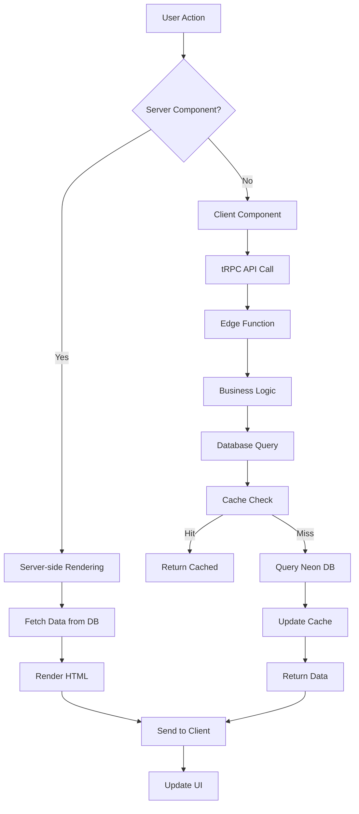
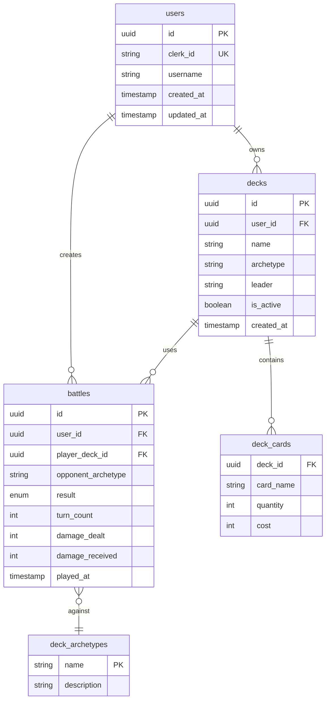

# シャドウバース EVOLVE 戦績管理ツール - アーキテクチャ設計書

## 📋 プロジェクト概要

### 作りたいもの
**シャドウバース EVOLVE対戦記録・統計分析Webアプリケーション**

#### 主要機能
1. **戦績記録**
   - 対戦結果の記録（勝敗、使用デッキ、対戦相手デッキ）
   - 対戦日時

2. **統計分析**
   - 総合勝率、デッキ別勝率
   - マッチアップ相性表
   - 時系列での成績推移
   - AIによる戦績インサイト

3. **モバイル対応**
   - PWA（Progressive Web App）
   - オフライン対応
   - リアルタイム同期

## 🛠️ 技術スタック

### フロントエンド
```yaml
Framework: Next.js 15.0
  - App Router
  - React Server Components
  - Server Actions
  
UI Library: React 19
  - Concurrent Features
  - Suspense Boundaries
  
Styling: 
  - Tailwind CSS 3.4
  - shadcn/ui (Radix UI based)
  
State Management: Zustand 4.5
Type Safety: TypeScript 5.5
Forms: React Hook Form + Zod
Charts: Recharts 2.12
PWA: next-pwa 5.6
```

### バックエンド
```yaml
Runtime: Edge Runtime (Vercel Edge Functions)
API: 
  - REST API (App Router API Routes)
  - python or rust
  
Database:
  - Neon (Serverless PostgreSQL)
  - Drizzle ORM 0.33
  
Cache: 
  - Vercel KV (Redis互換)
  - React Query (Client-side)
```

### 認証・セキュリティ
```yaml
Authentication: Clerk
  - Passwordless (Passkeys)
  - OAuth (Google, Discord)
  - Multi-factor Authentication
  
Security:
  - Row Level Security (RLS)
  - API Rate Limiting
  - Content Security Policy
```

### インフラ・デプロイ
```yaml
Hosting: Vercel
  - Edge Network (Global CDN)
  - Automatic Scaling
  
CI/CD: 
  - GitHub Actions
  - Vercel Preview Deployments
  
Development:
  - Cursor/Windsurf (AI-assisted coding)
  - Biome (Linting/Formatting)
  - Vitest (Unit Testing)
  - Playwright (E2E Testing)
```

## 🏗️ システムアーキテクチャ

### 全体構成図
```
┌─────────────────────────────────────────────────────────┐
│                    Client (Browser/PWA)                  │
│  ┌─────────────┐  ┌──────────────┐  ┌───────────────┐ │
│  │React Server │  │Client Comps  │  │  Service      │ │
│  │Components   │  │(Interactive) │  │  Worker       │ │
│  └─────────────┘  └──────────────┘  └───────────────┘ │
└────────────────────────┬────────────────────────────────┘
                         │ HTTPS
┌────────────────────────┴────────────────────────────────┐
│                 Vercel Edge Network                      │
│  ┌─────────────┐  ┌──────────────┐  ┌───────────────┐ │
│  │   Edge      │  │   Static     │  │   Image       │ │
│  │ Functions   │  │   Assets     │  │ Optimization  │ │
│  └──────┬──────┘  └──────────────┘  └───────────────┘ │
└─────────┼───────────────────────────────────────────────┘
          │
┌─────────┴───────────────────────────────────────────────┐
│                    Backend Services                      │
│  ┌─────────────┐  ┌──────────────┐  ┌───────────────┐ │
│  │    Neon     │  │  Vercel KV   │  │  Together AI  │ │
│  │ PostgreSQL  │  │   (Cache)    │  │    (LLM)      │ │
│  └─────────────┘  └──────────────┘  └───────────────┘ │
│  ┌─────────────┐  ┌──────────────┐  ┌───────────────┐ │
│  │   Clerk     │  │   PostHog    │  │    Sentry     │ │
│  │   (Auth)    │  │ (Analytics)  │  │ (Monitoring)  │ │
│  └─────────────┘  └──────────────┘  └───────────────┘ │
└─────────────────────────────────────────────────────────┘
```

### データフロー


## 📁 プロジェクト構造

```
shadowverse-stats/
├── app/                          # Next.js App Router
│   ├── (auth)/                   # 認証関連ページ
│   │   ├── sign-in/
│   │   └── sign-up/
│   ├── (dashboard)/              # メインアプリ
│   │   ├── layout.tsx            # ダッシュボードレイアウト
│   │   ├── page.tsx              # ダッシュボード
│   │   ├── battles/              # 対戦記録
│   │   │   ├── page.tsx          # 一覧
│   │   │   ├── new/page.tsx      # 新規登録
│   │   │   └── [id]/page.tsx     # 詳細
│   │   ├── decks/                # デッキ管理
│   │   ├── statistics/           # 統計
│   │   └── insights/             # AIインサイト
│   ├── api/                      # API Routes
│   │   ├── trpc/[trpc]/route.ts  # tRPCハンドラ
│   │   └── ai/insights/route.ts  # AI API
│   ├── layout.tsx                # ルートレイアウト
│   └── globals.css               # グローバルCSS
│
├── components/                    # UIコンポーネント
│   ├── ui/                       # shadcn/ui
│   ├── charts/                   # グラフコンポーネント
│   ├── forms/                    # フォーム
│   └── layouts/                  # レイアウト
│
├── lib/                          # ライブラリ・ユーティリティ
│   ├── db/                       # データベース
│   │   ├── schema.ts             # Drizzleスキーマ
│   │   ├── queries/              # クエリ関数
│   │   └── migrations/           # マイグレーション
│   ├── trpc/                     # tRPC設定
│   │   ├── server.ts
│   │   ├── client.ts
│   │   └── routers/
│   ├── auth/                     # 認証ヘルパー
│   ├── ai/                       # AI統合
│   └── utils/                    # ユーティリティ
│
├── hooks/                        # カスタムフック
├── stores/                       # Zustand stores
├── types/                        # TypeScript型定義
├── public/                       # 静的ファイル
│   ├── manifest.json             # PWAマニフェスト
│   └── sw.js                     # Service Worker
│
├── tests/                        # テスト
│   ├── unit/
│   └── e2e/
│
└── config files                  # 設定ファイル
    ├── next.config.js
    ├── tailwind.config.ts
    ├── drizzle.config.ts
    ├── biome.json
    └── vitest.config.ts
```

## 💾 データベース設計

### ERD（Entity Relationship Diagram）


### Drizzle ORMスキーマ
```typescript
// lib/db/schema.ts
import { pgTable, uuid, text, timestamp, integer, boolean, pgEnum } from 'drizzle-orm/pg-core';

export const resultEnum = pgEnum('result', ['win', 'loss', 'draw']);

export const users = pgTable('users', {
  id: uuid('id').defaultRandom().primaryKey(),
  clerkId: text('clerk_id').notNull().unique(),
  username: text('username').notNull(),
  createdAt: timestamp('created_at').defaultNow(),
  updatedAt: timestamp('updated_at').defaultNow(),
});

export const decks = pgTable('decks', {
  id: uuid('id').defaultRandom().primaryKey(),
  userId: uuid('user_id').references(() => users.id),
  name: text('name').notNull(),
  archetype: text('archetype').notNull(),
  leader: text('leader').notNull(),
  isActive: boolean('is_active').default(true),
  createdAt: timestamp('created_at').defaultNow(),
});

export const battles = pgTable('battles', {
  id: uuid('id').defaultRandom().primaryKey(),
  userId: uuid('user_id').references(() => users.id),
  playerDeckId: uuid('player_deck_id').references(() => decks.id),
  opponentArchetype: text('opponent_archetype').notNull(),
  result: resultEnum('result').notNull(),
  turnCount: integer('turn_count'),
  damageDealt: integer('damage_dealt'),
  damageReceived: integer('damage_received'),
  playedAt: timestamp('played_at').defaultNow(),
});
```

## 🔄 API設計

### tRPC Router構成
```typescript
// lib/trpc/routers/index.ts
export const appRouter = router({
  // 認証
  auth: authRouter,
  
  // 対戦記録
  battles: router({
    list: protectedProcedure
      .input(z.object({
        limit: z.number().default(20),
        cursor: z.string().optional(),
      }))
      .query(async ({ ctx, input }) => {
        // 実装
      }),
    
    create: protectedProcedure
      .input(createBattleSchema)
      .mutation(async ({ ctx, input }) => {
        // 実装
      }),
    
    stats: protectedProcedure
      .input(z.object({
        dateRange: z.enum(['week', 'month', 'all']),
      }))
      .query(async ({ ctx, input }) => {
        // 統計データ取得
      }),
  }),
  
});
```

## 🎯 主要機能の実装詳細

### 1. リアルタイム統計ダッシュボード
```typescript
// app/(dashboard)/page.tsx
export default async function Dashboard() {
  const stats = await getOverviewStats();
  
  return (
    <div className="grid gap-4 md:grid-cols-2 lg:grid-cols-4">
      <StatsCard title="総合勝率" value={stats.winRate} />
      <StatsCard title="今月の対戦数" value={stats.monthlyBattles} />
      <StatsCard title="最高連勝" value={stats.winStreak} />
      <StatsCard title="お気に入りデッキ" value={stats.favoriteDeck} />
      
      <WinRateChart data={stats.chartData} />
      <RecentBattles battles={stats.recentBattles} />
    </div>
  );
}
```

### 2. AI戦績分析
```typescript
// lib/ai/insights.ts
export async function generateInsights(battles: Battle[]) {
  const response = await ai.generate({
    model: 'meta-llama/Llama-3.2-11B-Vision-Instruct-Turbo',
    system: 'あなたはカードゲームの戦績分析専門家です。',
    prompt: `以下の戦績データから有用なインサイトを生成してください...`,
  });
  
  return response.text;
}
```

### 3. PWA対応
```javascript
// public/sw.js
self.addEventListener('install', (event) => {
  event.waitUntil(
    caches.open('v1').then((cache) => {
      return cache.addAll([
        '/',
        '/offline',
        '/manifest.json',
      ]);
    })
  );
});
```

## 🚀 デプロイメント戦略

### 環境構成
```yaml
Development:
  - Local development with Vercel CLI
  - Neon branching for DB isolation
  
Preview:
  - Automatic preview deployments
  - Branch-based deployments
  
Production:
  - Vercel Edge Network
  - Automatic scaling
  - Zero-downtime deployments
```

### CI/CDパイプライン
```yaml
# .github/workflows/deploy.yml
name: Deploy
on:
  push:
    branches: [main]
  pull_request:

jobs:
  test:
    runs-on: ubuntu-latest
    steps:
      - uses: actions/checkout@v4
      - uses: actions/setup-node@v4
      - run: npm ci
      - run: npm run test
      - run: npm run lint
      
  deploy:
    needs: test
    if: github.ref == 'refs/heads/main'
    runs-on: ubuntu-latest
    steps:
      - uses: actions/checkout@v4
      - uses: vercel/action@v2
        with:
          vercel-token: ${{ secrets.VERCEL_TOKEN }}
```

## 📊 パフォーマンス目標

### Core Web Vitals
- **LCP**: < 2.5s
- **FID**: < 100ms  
- **CLS**: < 0.1
- **TTFB**: < 200ms (Edge Runtime)

### スケーラビリティ
- 同時接続数: 10,000+
- API応答時間: < 100ms (p95)
- データベース接続: Pooling対応
- キャッシュヒット率: > 90%

## 🔐 セキュリティ対策

### 実装項目
1. **認証・認可**
   - Clerk統合によるセキュアな認証
   - Row Level Security (RLS)
   - API Rate Limiting

2. **データ保護**
   - HTTPS強制
   - CSP (Content Security Policy)
   - XSS/CSRF対策

3. **監視・監査**
   - Sentryによるエラー追跡
   - Axiomによるログ収集
   - 異常検知アラート
